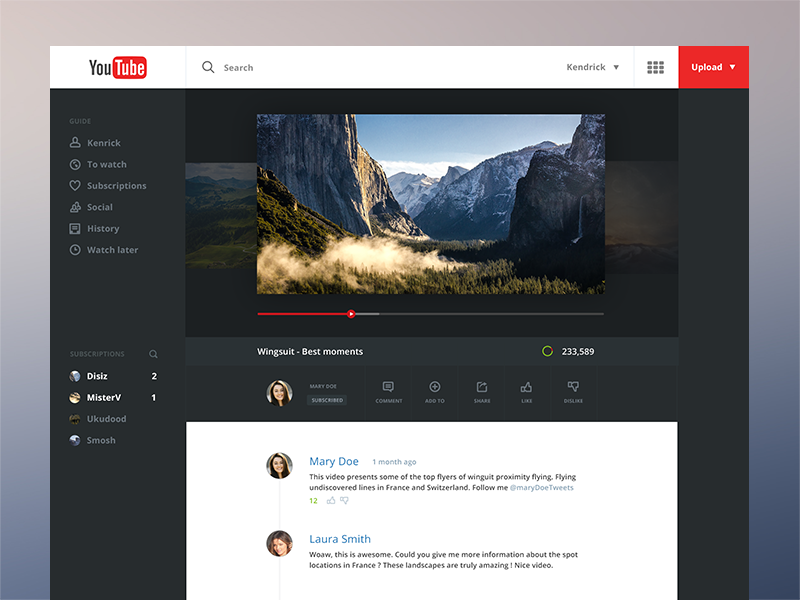

# Project: Clone App - StackTrek Activity - 21/08/23

YouTube Redesign Clone based on Aurélien Salomon UX's design at https://dribbble.com/shots/1338727-Youtube-Redesign

**Candidate:** Chizaram Igolo

# Cloned Website



## Dissecting Activity

### `<SidebarHeaderComponent />`


```js
export default function ({ heading }) {
  return <div className="uppercase pl-2">{heading}</div>;
}
```

<br />

### `<SidebarLinkComponent />`


```js
export default function SidebarLinkComponent({ text, icon }) {
  return (
    <li className="sidebar-link">
      <span className="px-2">{icon}</span>
      <span>{text}</span>
    </li>
  );
}
```

<br />

### `<SidebarComponent />`


```js
export default function SidebarComponent() {
  return (
    <div className="bg-[#272C2E] col-span-2">
      <SidebarHeaderComponent heading="Guide" />
      {sidebarLinks.map(({ text, icon }) => (
        <SidebarLinkComponent text={text} icon={icon} key={text} />
      ))}
    </div>
  );
}
```

## Data Array

```js
export const comments = [
  {
    name: "Mary Doe",
    date: "1 month ago",
    text: "This video presents some of the the top flyers of wingsuit proximity flying. Flying undiscovered lines in France and Switzerland. Follow me @maryDoeTweets.",
    likes: 12,
  },
  {
    name: "Laura Smith",
    date: "2 weeks ago",
    text: "Wow, this is awesome. Could you give me more information about the spot locations in France? These landscapes are truly amazing! Nice video.",
    likes: 0,
  },
];
```

## Skills demonstrated

- Proficiency with React
- Proficiency with HTML and CSS
- Using ES6 JavaScript

## Stack

- React
- Tailwind CSS
